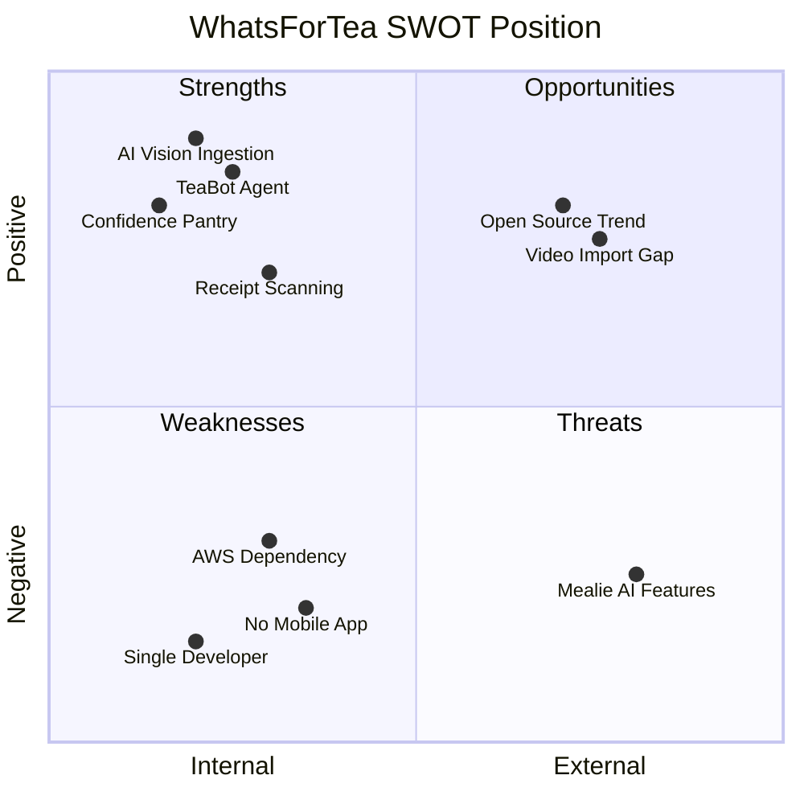

# WhatsForTea — Competitive Appraisal vs Market Leaders

*April 2026 · Based on README.md, CLAUDE.md, PRODUCT_OVERVIEW.md, and current public documentation for competitors.*

---

## 1. The Competitors

| App | Category | Licence / Price | Users | Maturity |
|-----|----------|-----------------|-------|----------|
| **Mealie** (v1.12+) | Self-hosted, open-source | MIT — free | ~15k GitHub stars, active community | 4+ years, frequent releases |
| **Paprika 3** | Consumer native app | One-time purchase (~£5/platform) | Millions of downloads, App Store staple | 10+ years, maintenance mode |
| **WhatsForTea** (v2.1) | Self-hosted, GPL v3 | GPL v3 — not yet publicly hosted | 1 household | ~2 months, feature-complete |

> [!NOTE]
> Mealie is the closest apples-to-apples competitor (self-hosted, Docker, web UI). Paprika 3 represents the **consumer gold standard** — what a non-technical user would compare the experience to.

---

## 2. Feature Scoring (Head-to-Head)

Rating scale: **◼◼◼** = best-in-class · **◼◼◻** = solid · **◼◻◻** = basic · **◻◻◻** = absent

| Capability | WhatsForTea | Mealie | Paprika 3 | Notes |
|-----------|:-----------:|:------:|:---------:|-------|
| **Recipe import from URL** | ◼◼◻ | ◼◼◼ | ◼◼◼ | Mealie supports 700+ sites natively; Paprika's built-in browser strips ads. WFT uses LLM extraction — flexible but slower. |
| **Physical card digitisation** | ◼◼◼ | ◻◻◻ | ◻◻◻ | **Unique to WFT.** Claude vision extracts structured data from photos. No competitor does this. |
| **Recipe OCR (images)** | ◼◼◼ | ◼◼◻ | ◻◻◻ | Mealie added AI-image import recently. WFT's is purpose-built for meal-kit cards with bounding-box crops. |
| **Video-to-recipe** | ◻◻◻ | ◼◼◼ | ◻◻◻ | Mealie can import from YouTube/TikTok/Instagram. WFT doesn't attempt this. |
| **Pantry management** | ◼◼◼ | ◼◻◻ | ◼◻◻ | WFT's confidence-decay model is genuinely novel. Mealie's is basic quantity tracking. Paprika tracks items but no intelligence. |
| **Pantry-to-recipe matching** | ◼◼◼ | ◼◼◻ | ◻◻◻ | WFT scores continuously with weighted confidence. Mealie does binary "have / don't have". Paprika has no matching. |
| **"Use it up" / waste reduction** | ◼◼◼ | ◻◻◻ | ◻◻◻ | Unique to WFT — re-ranks by expiry proximity. |
| **AI chat assistant** | ◼◼◼ | ◻◻◻ | ◻◻◻ | **Unique to WFT.** LangGraph agent with HITL, SSE streaming, and full kitchen context. |
| **Receipt scanning** | ◼◼◼ | ◻◻◻ | ◻◻◻ | **Unique to WFT.** Photo/PDF → bulk pantry add via LLM. |
| **Barcode scanning** | ◼◼◻ | ◼◼◻ | ◻◻◻ | Both WFT and Mealie use Open Food Facts. Paprika lacks this. |
| **Meal planning** | ◼◼◻ | ◼◼◼ | ◼◼◼ | Mealie has drag-and-drop calendar. Paprika has reusable menus. WFT has weekly planner with AI auto-fill. |
| **Shopping list** | ◼◼◼ | ◼◼◻ | ◼◼◼ | WFT uniquely offers pack-size rounding and WhatsApp export. Paprika sorts by aisle. |
| **Cooking mode** | ◼◼◼ | ◻◻◻ | ◼◼◼ | WFT and Paprika both have step-by-step with timers. WFT adds voice commands and session history. Mealie lacks cooking mode. |
| **Voice commands** | ◼◼◻ | ◻◻◻ | ◻◻◻ | WFT only (LLM-parsed intents during cooking). iOS limitations reduce the score. |
| **Nutritional info** | ◼◼◻ | ◼◼◻ | ◼◼◻ | WFT uses AI estimates. Mealie/Paprika rely on manual or external DB lookups. None are medically validated. |
| **Multi-user / household** | ◼◼◻ | ◼◼◼ | ◼◻◻ | Mealie has groups, OpenID Connect, SSO. WFT has invite codes + per-user history. Paprika has limited sharing. |
| **Duplicate detection** | ◼◼◼ | ◻◻◻ | ◻◻◻ | AI-powered dedup — unique to WFT. |
| **Ingredient normalisation** | ◼◼◼ | ◼◼◻ | ◼◻◻ | WFT's 4-layer pipeline (100% golden set) is the most robust. Mealie has NLP parsing + unit DB. Paprika does basic consolidation. |
| **Mobile experience** | ◼◻◻ | ◼◼◻ | ◼◼◼ | Paprika wins decisively — native iOS/Android with offline. WFT is responsive PWA. Mealie is web-only. |
| **Offline capability** | ◻◻◻ | ◼◻◻ | ◼◼◼ | Paprika stores everything locally. WFT requires server connection. |
| **Setup simplicity** | ◼◻◻ | ◼◼◻ | ◼◼◼ | Paprika: download from App Store. Mealie: `docker run`. WFT: Docker + AWS Bedrock credentials + `.env` config. |
| **Community & ecosystem** | ◻◻◻ | ◼◼◼ | ◼◼◻ | Mealie has 15k+ stars, plugins, webhook integrations, Home Assistant support. WFT is private with a single user. |
| **Long-term maintainability** | ◼◻◻ | ◼◼◼ | ◼◼◻ | Mealie has bus-factor >1, CI/CD, contributor base. Paprika is in maintenance mode. WFT is solo-developer. |
| **Data sovereignty** | ◼◼◼ | ◼◼◼ | ◼◼◻ | WFT and Mealie: fully local. Paprika uses cloud sync (their servers). |
| **Observability** | ◼◼◼ | ◻◻◻ | ◻◻◻ | Langfuse tracing, Prometheus, structured JSON logs — unique to WFT. |
| **REST API** | ◼◼◼ | ◼◼◼ | ◻◻◻ | Both self-hosted apps expose full APIs. Paprika is closed. |

---

## 3. Where WhatsForTea Genuinely Wins

### 🏆 Uncontested differentiators (no competitor equivalent)

1. **Physical card digitisation via AI vision** — the founding use case. Mealie added image OCR recently but it's generic; WFT's is purpose-built for meal-kit card layouts with step-image bounding boxes.

2. **Confidence-decay pantry model** — no competitor models uncertainty. "I probably still have garlic" vs "I definitely just bought garlic" is a real distinction that changes recipe recommendations.

3. **TeaBot AI assistant with HITL** — a contextual agent that knows your pantry, plan, and history, and can take actions (add to pantry, update plan, add to shopping list) with confirmation. This is genuinely ahead of the market.

4. **Receipt scanning → pantry population** — the fastest path from "I just came home from Tesco" to an updated pantry.

5. **Pack-size-rounded shopping lists** — you can't buy 150g of chicken; you buy a 500g pack. WFT handles this. Nobody else does.

6. **Config-driven LLM layer** — prompts in Jinja2 templates, model IDs in env vars. Swap Haiku for Sonnet with zero code changes. This is an engineering quality differentiator.

### ✅ Strong but not unique

- Cooking mode with voice commands and session history
- "Use it up" waste-reduction scoring  
- AI-powered duplicate detection
- Hangry matcher (continuous scoring vs binary matching)
- Ingredient normaliser (4-layer, 100% golden set)

---

## 4. Where WhatsForTea Genuinely Loses

### 🔴 To Paprika 3

| Area | Gap | Severity |
|------|-----|----------|
| **Native mobile experience** | Paprika is a polished native app with offline. WFT is a responsive web app. | High — mobile is the primary cooking surface |
| **Zero setup** | Download from App Store vs Docker + AWS credentials | High — blocks 95% of potential users |
| **Offline operation** | Paprika works without internet. WFT needs server + AWS for LLM features. | Medium |
| **Cross-device sync** | Paprika syncs seamlessly. WFT is server-dependent. | Low (server is always-on for NAS users) |
| **Maturity / polish** | 10+ years of iteration vs 2 months | Medium — edge cases, error handling, UX consistency |

### 🔴 To Mealie

| Area | Gap | Severity |
|------|-----|----------|
| **URL scraping breadth** | Mealie supports 700+ sites natively. WFT uses LLM which is flexible but slower and costs money per import. | Medium |
| **Video-to-recipe import** | Mealie can import from YouTube, TikTok, Instagram. WFT cannot. | Low-Medium |
| **Community & ecosystem** | 15k+ GitHub stars, webhooks, Home Assistant integration, plugin ecosystem. WFT has none. | High for adoption |
| **Authentication** | Mealie supports OpenID Connect / OAuth / LDAP. WFT is JWT + invite codes only. | Medium |
| **Open source** | Mealie is MIT. WFT is GPL v3 but not yet publicly hosted — can't be forked or contributed to until the repo is made public, which requires no license change. | Medium for trust |
| **Multi-household** | Mealie supports multiple groups on one instance. WFT is single-household. | Low (most users only need one) |
| **UI polish** | Mealie has had years of community design iteration. | Medium |
| **Bus factor** | Mealie has a contributor community. WFT is a single developer. | High for longevity |

---

## 5. SWOT Analysis

### Strengths
- AI-native from the ground up (not bolted on)
- Solves a real, specific problem no competitor addresses (physical card → digital)
- Production-quality engineering (structured logging, Langfuse, Prometheus, Alembic migrations, 95 tests)
- Config-driven architecture makes it easy to iterate without code changes
- Full-stack vertical integration (ingestion → normalisation → pantry → matching → planning → cooking → consumption)

### Weaknesses
- Single developer — no community, no contributions, no redundancy
- Repository is private — can't build trust through transparency (though GPL v3 is already in place; publishing requires no licence change)
- AWS Bedrock is a hard dependency for core features
- No native mobile app — cooking happens on phones/tablets
- Golden test set is HelloFresh UK cards — systematic accuracy benchmarks exist only for that format (though real-world usage has confirmed other card formats and URLs work)
- No CI/CD pipeline mentioned in documentation
- iOS voice limitations reduce a headline feature

### Opportunities
- **Open-source it** — instant credibility, community contributions, and adoption
- **Video-to-recipe** — Mealie has it, WFT's LLM architecture could support it
- **PWA enhancements** — service worker caching for offline recipe viewing during cooking
- **Multi-provider LLM** — reduce AWS lock-in by supporting Ollama/local models for text tasks
- **Supermarket API integration** — even basic Tesco/Ocado basket push would be transformative
- **Gousto/other meal-kit card support** — widen the ingestion funnel

### Threats
- **Mealie adding AI features** — they've already added image OCR and video import; if they add pantry intelligence, the gap narrows significantly
- **Paprika adding OCR** — Recipe Keeper and Crouton already offer camera-based scanning; Paprika could follow
- **AWS cost/access changes** — Bedrock pricing or availability changes could break the value proposition
- **LLM commoditisation** — as AI recipe parsing becomes table-stakes, the differentiator shifts to UX and ecosystem

---

## 6. Product Maturity Assessment

| Dimension | Score | Evidence |
|-----------|:-----:|----------|
| **Feature completeness** | 9/10 | All 10 core phases + 4 post-v1 tiers + v2 features complete. 30+ features shipped. |
| **Engineering quality** | 8/10 | Async throughout, structured logging, Langfuse, Prometheus, Alembic, ruff/bandit clean, 95 tests. No CI/CD or staging environment documented. |
| **UX / design** | 6/10 | Functional but not as polished as Mealie or Paprika. iPad responsive redesign recently completed. Dark mode present. No design system documentation. |
| **Documentation** | 9/10 | Excellent. README, CLAUDE.md, PRODUCT_OVERVIEW.md are thorough and honest. API documented endpoint-by-endpoint. |
| **Scalability** | 7/10 | Single-household design. PostgreSQL + Redis is solid. No horizontal scaling but not needed at household scale. |
| **Security** | 8/10 | JWT httpOnly, Argon2id, brute-force protection, input sanitisation, bandit clean. No HTTPS termination documented (relies on Caddy/reverse proxy). |
| **Maintainability** | 7/10 | Config-driven LLM layer is excellent. Bus factor of 1 is the main concern. |
| **Market readiness** | 4/10 | Private, single-user, requires Docker + AWS. Not ready for broader adoption without significant distribution work. |

**Overall product maturity: 7.3/10** — technically impressive, strategically limited.

---

## 7. The Honest Verdict

### What WhatsForTea is:
> A technically sophisticated, AI-native kitchen assistant that solves a specific problem — *"I have a drawer full of HelloFresh cards and a fridge full of ingredients; what should I cook?"* — better than anything else on the market.

### What it isn't:
> A general-purpose recipe app that can compete with Mealie or Paprika on breadth, community, or accessibility.

### The key question:
> **Does the AI intelligence layer (vision ingestion + confidence pantry + TeaBot + receipt scanning) justify choosing WFT over a mature, free, open-source alternative like Mealie?**

**For your specific household: unequivocally yes.** You have physical HelloFresh cards. You cook regularly. You have a NAS. You have AWS credentials. You're the developer. Every unique feature was built for exactly this use case, and no competitor can match the end-to-end flow from card photo → normalised recipe → pantry-scored recommendation → cooking session → pantry consumption.

**For the broader market: not yet.** The setup barrier (Docker + AWS), lack of open-source transparency, single-developer risk, and absence of a native mobile app mean that most home cooks would be better served by Mealie (if they want self-hosted) or Paprika (if they want simplicity).

---

## 8. Strategic Recommendations (If You Wanted to Close the Gap)

| Priority | Action | Impact |
|:--------:|--------|--------|
| 1 | **Publish the repository** | GPL v3 is already in place — making the repo public is the only step needed. Biggest single lever for adoption, trust, and longevity. |
| 2 | **Add offline recipe viewing** | Service worker cache for recipe detail pages. Cooking shouldn't depend on connectivity. |
| 3 | **Support local LLM fallback** (Ollama) | Remove AWS as a hard dependency for text tasks. Keep Bedrock for vision. |
| 4 | **CI/CD pipeline** | GitHub Actions for tests, lint, Docker build. Professional credibility. |
| 5 | **Widen card format support** | Test and tune for Gousto, Dinnerly, EveryPlate. Multiply the addressable audience. |
| 6 | **Video-to-recipe import** | Mealie has it. Your LLM architecture already supports it. |
| 7 | **PWA install prompt + app icon** | Low-effort improvement to mobile experience. |

---

*This appraisal is intentionally honest about both strengths and limitations, matching the tone set by your own PRODUCT_OVERVIEW.md — which, incidentally, is one of the most refreshingly candid product documents I've reviewed.*
